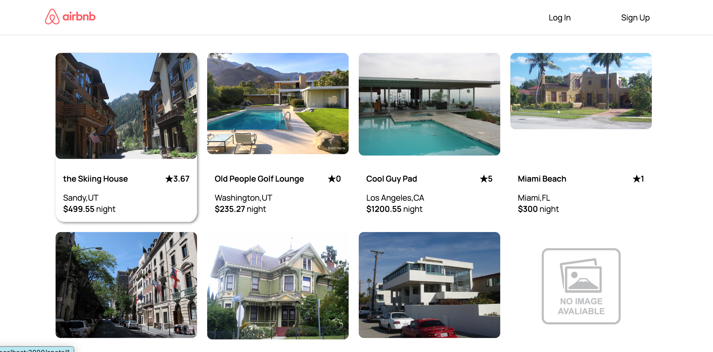
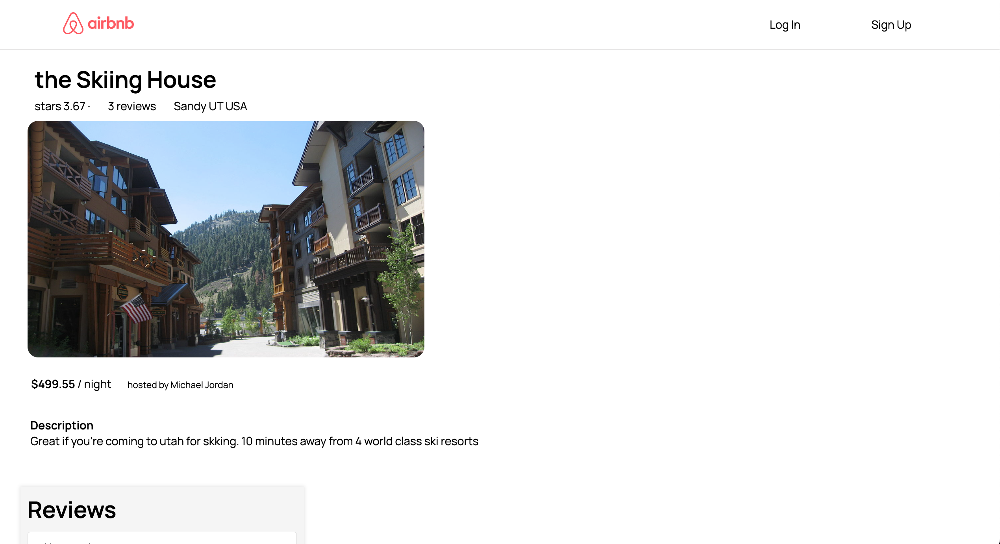
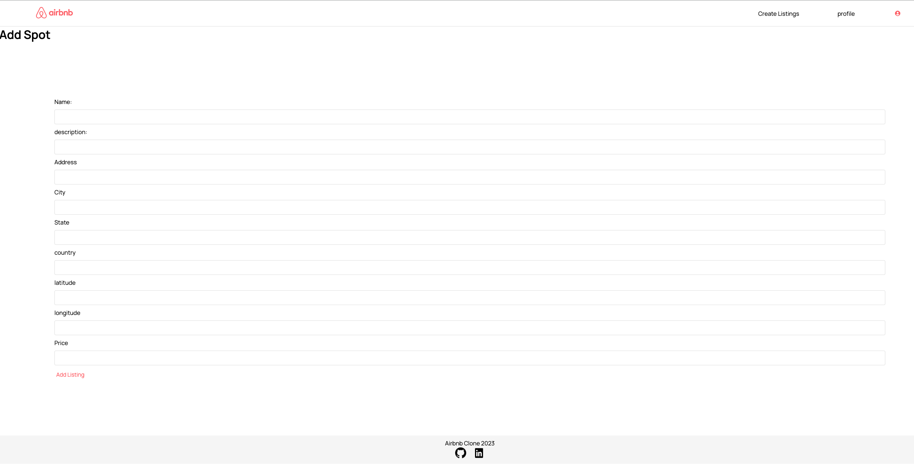
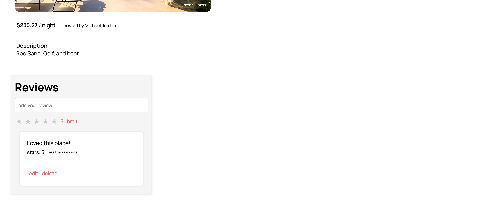
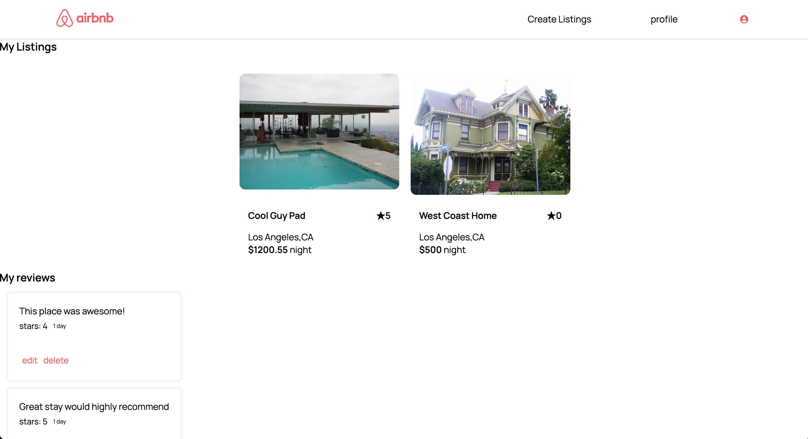
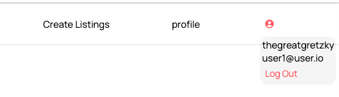
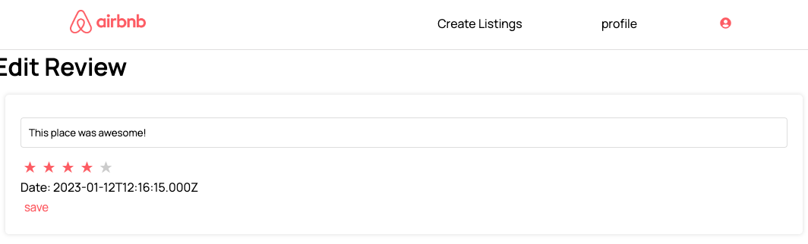

Previous link was https://lightweightairbnbclone.onrender.com/ but now is https://lightweightairbnb.onrender.com/
<h1>airbnb-clone </h1>

Welcome to the airbnb-clone project! This project is a recreation of the popular vacation rental platform, airbnb. The goal of this project is to provide users with a similar experience to the original airbnb website, including the ability to search for and book unique accommodations around the world.

<h1>Screenshots</h1>

Please see the screenshots folder for examples of the project in action.

<h1>CRUD Features</h1>
The airbnb-clone project includes CRUD (Create, Read, Update, Delete) features for both the Spots and Reviews sections of the website. Users are able to create new listings for accommodations, as well as read, update, and delete existing listings. Additionally, users can leave reviews for accommodations they have stayed at and edit or delete their own reviews.

Technologies Used

<h2 align=center>Technologies</h2>

  
  
   
   
   
   
  
  
  
   
  

<h1>how to get started </h1>

Clone the repository and navigate to the project directory
Run npm install to install all necessary dependencies
Create a .env file and add the following variables:
PORT: the port number you would like the application to run on
DB_FILE: the file path for your database
JWT_SECRET: a secret phrase for JSON Web Token authentication
SCHEMA: "airbnb_clone"

To build or reset the database and run seeders, use the command "npm run rebuild". Run the command "npm start" to start the development server in both the front end and backend folders. 
The application should now be running on the port specified in your .env file.
Please note that the above instructions assume that you have the necessary dependencies (Node.js, Postgres) installed on your machine. If you are missing any dependencies, please refer to their respective documentation to learn how to install them. 

